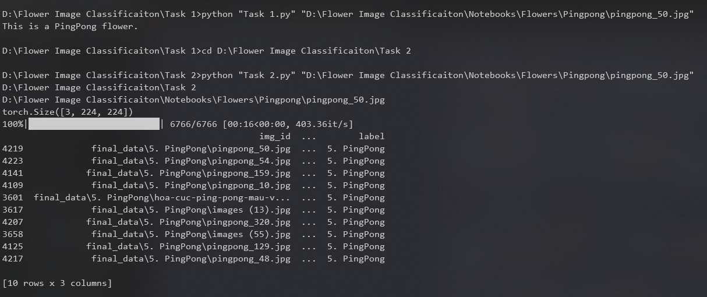

# Flower Images Classification using CNN

## COSC2753 - Machine Learning Assignment 2 - Group T3_G06

### Libraries Requirement
- pillow
- torch
- numpy
- pandas
- torchvision
- pickle
- tqdm
- matplotlib
- annoy

### Setup
How to run this project: 

1. Download the zip file and unzip the file
2. To run the model for task 1 and task 2, open and run from Command Prompt

#### Task 1: 
~~~
- Open the Task 1 folder to get the location of Task_1.py file inside Task 1 folder
- Use "cd path/to/directory" command in your Command Prompt to navigate and switch your current directory to Task 1 folder
- After your directory in Command Prompt is pointed to Task 1 folder, type the below command and run:
	python "Task 1.py" "path/your_chosen_test_image"
~~~

#### Task 2:
~~~
- Change directory to folder "Task 2". (cd path/to/directory)
- Use command: 
	python "Task 2.py" "path/your_chosen_test_image"

- After finish running, go to folder "Task 2" to find file "reverse_search_output.png" to see the result.
~~~

### Result:

